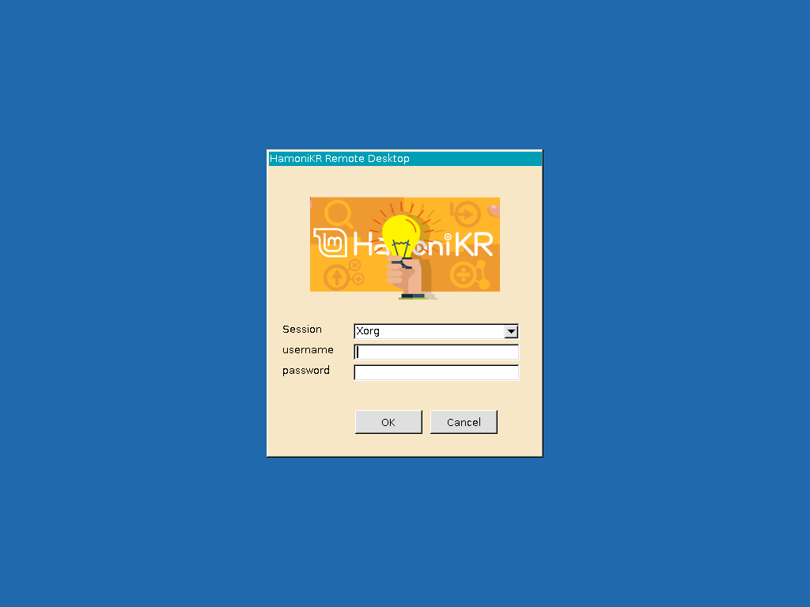

# RDP for hamonikr

xdrp setting tool for HamoniKR-ME (>= 1.4)

하모니카 PC에 원격데스크탑을 이용하여 사용할 수 있도록 지원하는 프로그램



# 주요 기능
- enable sound redirection
- enable clipboard (file copy and paste)
- compress transfer packet
- performance turning

# Install
다운로드 받은 디렉토리 안으로 이동하여 아래 명령어를 입력

```sudo ./xrdp-install.sh```

설치 후 자동으로 시스템이 재시작 됩니다.

 * 접속하려는 하모니카 PC는 로그아웃 상태로 대기해야 합니다.
 * 다중 사용자를 지원하지만 원격지 PC의 사용자가 로그인 중인 경우 일부 프로그램은 작동되지 않습니다.

 # 이슈 또는 버그
 사용 중 문제를 발견하시면 root@hamonikr.org 또는 https://groups.google.com/forum/m/#!forum/hamonikr 에서 알려주세요.